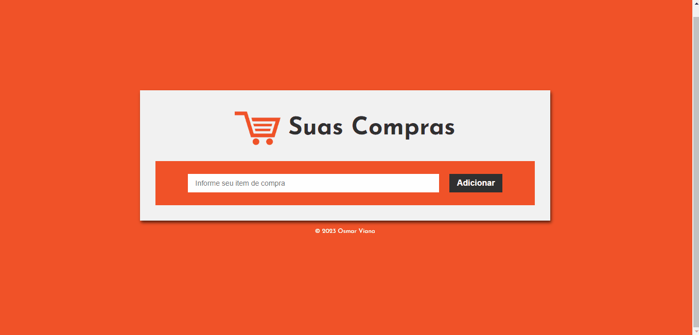
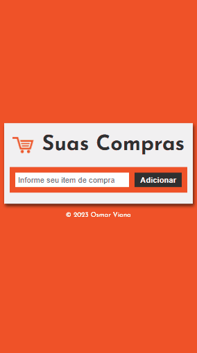

# Projeto Lista de Compras

Você cria sua lista de compras de supermercado adicionando os itens que deseja comprar e vai atualizando com valor e quantidade de cada item. Assim você terá um controle do que vai comprar e dos valores, possibilitando que gaste apenas aquilo que se propõe a gastar e não sai do orçamento.

## Objetivo

### O projeto foi criado para praticar alguns conceitos de JavaScript como variáveis, funções, eventos DOM, métodos e estruturas condicionais.

 

### Observação

Optei por manter os comentários no código para finalidade didática, já que acabei usando conceitos que não conhecia em partes do código e preciso relembrar para que serve cada parte.

 

### Tela Desktop

 

 

### Tela Mobile

 

 

## Sobre o projeto

O projeto utiliza JavaScript para criar uma lista de compras com cálculo automático. As principais ferramentas usadas são seleção/manipulação de elementos do DOM, eventos, armazenamento/manipulação de dados, cálculos matemáticos e atualização dinâmica do conteúdo. O código adiciona itens à lista, calcula valores totais, remove itens e exibe os resultados no navegador.

 

## Ferramentas usadas

- HTML
- CSS
- JavaScript

 

## Links

https://osmarviana.github.io/lista-compras

 

# Autor

## Osmar Viana

 
  
   
  
   
  
   

